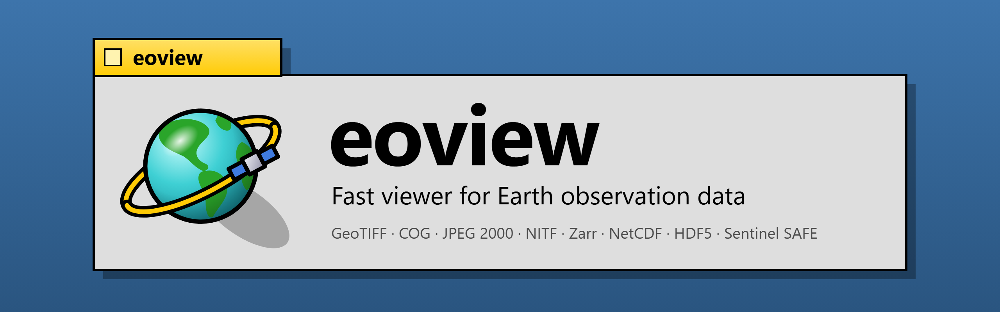

<p align="center"></p>

# eoview

Fast viewer for Earth observation data. Rust, wgpu (WebGPU API), egui.

`eoview` is a working name.

## Status

Phases 0, 1 and 2 of the specification are complete. Parts of phases 3 and 4 are done: remote data
(HTTP, S3, disk cache), time series with a timeline, and a first 3D globe view. `NEXT.md` lists the work
that is not done.

- Chunk engine: tokio does the I/O, rayon decodes, the UI thread never waits. Priorities from the views
  (coarse level first, screen center first), cancellation of tiles that are not visible.
- Byte sources: local files (memory map, zero-copy reads of uncompressed data), HTTP(S) and S3 range requests.
- Caches with budgets: raw bytes, decoded chunks, GPU tiles.
- Readers: GeoTIFF/COG, JPEG 2000, NITF (SICD, SIDD), EOPF Zarr v2 and v3, Sentinel-1, -2 and -3 SAFE, NetCDF-4/HDF5.
- Georeferencing: affine, geolocation arrays, geolocation grids (GCPs). Reprojection on the GPU with a warp mesh.
- RGB composites, band math, color maps, pixel inspector.
- Docking layout with layout presets, a stack of layers in each view, link groups (geographic or pixel),
  crosshair, compare modes (swipe, blend, difference, flicker), workspace files, command palette.

## Formats

| Format | Supported |
|---|---|
| TIFF, BigTIFF, GeoTIFF, COG | Strips and tiles. None, LZW, Deflate, Zstd, PackBits and JPEG compression. Predictors 2 and 3. Both byte orders. Overviews. GDAL no data value, scale, offset and band descriptions |
| NITF 2.1, NSIF 1.0 (SICD, SIDD) | Uncompressed (NC) and masked (NM) blocks, JPEG 2000 (C8), IMODE B, P and S, complex pixels (C, or I and Q), large images in more than one segment. Georeferencing from the SIDD plane projection, the SICD/SIDD image corners, or IGEOLO |
| JPEG 2000 (JP2, J2K) | Tiles and resolution levels (the levels are the overviews). OpenJPEG decoder |
| Zarr v2 and v3 (EOPF, GeoZarr) | Consolidated metadata or a local store. Sharding. Blosc (LZ4, zlib, Zstd; byte and bit shuffle), Zstd, zlib, gzip, LZ4, shuffle, delta, crc32c. Multiscales. Georeferencing from the x and y coordinates |
| NetCDF-4, HDF5 | Chunked and contiguous datasets, deflate, shuffle, Fletcher-32, Zstd. CF scale, offset, fill value, units. 1D or 2D latitude and longitude |
| Sentinel-2 L1C, L2A SAFE | All bands at their finest resolution, TCI, AOT, WVP, SCL. Reflectance scale and offset |
| Sentinel-1 L1 SAFE | GRD and SLC measurement files. Georeferencing from the geolocation grid of the annotation |
| Sentinel-3 SAFE (OLCI, SLSTR) | All NetCDF variables. Georeferencing from the geolocation arrays |
| Pixel types | 8, 16, 32 and 64-bit integers, 32 and 64-bit floats, complex integers and floats |

## Use

```
eoview [files, SAFE directories, Zarr stores, URLs or a workspace file]
eoview --series <files or URLs>      # the products are the time steps of one layer
eoview --globe <products>            # the first view is a 3D globe
eoview --info <path>     # structure of a product: variables, levels, chunks, georeferencing
```

Each product opens in its own view. With more than one product, the layout changes to a grid.

### Open

| Action | How |
|---|---|
| Open files in the view under the mouse | Drop the files on the view, or **Open** (Ctrl+O). More files open in more views |
| Open a product of a known type | The arrow of **Open**: Sentinel-1 SAFE, Sentinel-2 SAFE, Sentinel-3 SEN3, Zarr store, GeoTIFF/COG, JPEG 2000, NITF, NetCDF/HDF5. The type sets the dialog: it selects directories or files, with the file filter of the type |
| Open product directories (SAFE, SEN3, Zarr) | Drop the directory on the view, or the arrow of **Open**, then **Folder** (Ctrl+Alt+O). **Open** also accepts a file in the directory, for example `manifest.safe` or `xfdumanifest.xml`. A directory in the product (for example `GRANULE`) opens the product |
| Open a URL | The arrow of **Open**, then **URL** (Ctrl+L) |
| Open a recent product or workspace | The arrow of **Open**, then **Recent**, or the command palette |
| Add products as layers of a view | Shift + drop, or **Add layer** (Ctrl+Shift+O). Its arrow has the same menu |
| Save the workspace | **Save** (Ctrl+S) |
| Open a workspace | **Load**, Ctrl+O, or drop the `.eoview` file |

### Time

A layer has time steps if its product has a time dimension (Zarr, NetCDF-4), or if it is a list of products:
**Files as a time series** in the open menus, or `eoview --series <files or URLs>`. The order of a list is
the time in the name or in the path of each product.

The view then has a timeline at its bottom: step back (`,`), play or pause (Space), step forward (`.`), the
rate, one cell for each step (click or drag), the number and the time of the step. The view loads the next
3 steps ahead, at the resolution of the view. The playback waits for a step that is not ready: it does not
skip steps. The cells show the state of each step: green ready, amber loading, gray open, dark not open.
The linked views share the time cursor: their layers go to the step nearest in time.

`path#name` opens a product with the variable or band `name` first.

Real data with time, without an account:

```
# ESA Earth System Data Cube: 42 variables, 1978 steps of 8 days from 1979 to 2021, 0.25 degrees
eoview "https://deep-esdl-public.s3.eu-central-1.amazonaws.com/esdc-8d-0.25deg-1x720x1440-3.0.1.zarr#air_temperature_2m"
# 30 Sentinel-2 L2A true color images of tile 31TGK (Alps), March to August 2025, from the Earth Search STAC
eoview --series $(cat examples/s2_31TGK_2025_tci.txt)
```

### S3

`s3://bucket/key` opens an object of an S3 bucket (a file, or a Zarr store). The configuration is the
standard AWS configuration:

- Environment variables: `AWS_ACCESS_KEY_ID`, `AWS_SECRET_ACCESS_KEY`, `AWS_SESSION_TOKEN`, `AWS_REGION`,
  `AWS_ENDPOINT_URL`.
- The profile `AWS_PROFILE` (or `default`) of `~/.aws/credentials` and `~/.aws/config`. The environment
  variables are stronger.
- Without credentials, the requests have no signature: public buckets open without an account. The viewer
  asks AWS for the region of the bucket.

Copernicus Data Space Ecosystem (CDSE): make S3 keys in the CDSE S3 key manager, then use a profile:

```
# ~/.aws/credentials
[cdse]
aws_access_key_id = <key>
aws_secret_access_key = <secret>
# ~/.aws/config
[profile cdse]
endpoint_url = https://eodata.dataspace.copernicus.eu
```

```
AWS_PROFILE=cdse eoview s3://eodata/<path of a file of a product>
```

The viewer does not write the credentials to logs, to the cache or to workspace files.

The recent list is in the configuration directory of the user (`eoview/recent.json`). It contains paths
and URLs without the query, the fragment and the user information.

A workspace file (JSON) contains the layout, the views, the cameras, the layers and their settings. It
does not contain data. It does not contain the query, the fragment or the user information of URLs (they
can contain credentials or signed tokens).

### Interface

The menu bar has all commands with their keys: **File** (open, add a layer, workspaces), **Edit** (copy the
limits of the view, command palette), **View** (zoom, display CRS, side panel, views and layouts, link),
**Layer** (bands, presets, stretch, color maps), **Compare**, **Time**, **Help** (the list of the keys,
F1). The toolbar below it has the frequent commands as buttons. Each button shows its key in its tooltip.
The icons are drawn by the viewer: they do not depend on the fonts of the system.

At the start, a splash window shows first, with a progress bar: the GPU starts, then the products of the
command line open. Then the main window shows. The splash window closes after 15 seconds at most:
products that are slow to open continue in the main window.

### Views

The views are tabs of a dock: drag a tab to split, tab or move a view. The toolbar has the layout presets
1, 2, 2 x 2 and 3 x 3. The right-click menu of a view or of a tab has the view commands.

Linked views pan and zoom together. The badge at the top right of a view links or unlinks it with one
click. Link modes:

- **Geo**: the views have the same center latitude, center longitude and ground resolution (meters for
  each screen pixel). Views in different CRSs stay aligned.
- **Pixel**: the views show the same pixel region. For products on the same grid.

A new view joins the link group only if it shows data at the position of the group. Else it shows all its
data and stays unlinked. The views of a group show the cursor of the view under the mouse as a crosshair.

### Detached views

A view can have its own window, for example on a second screen. **Detach to a window** (Ctrl+Shift+D) is in
the right-click menu of a view or of a tab, and in the **View** menu. The window shows only the view and
its timeline.

- The view stays in its link group. The linked views pan and zoom together in all windows, with the
  crosshair and the time cursor.
- A click in the detached view makes it the active view. The side panel of the main window then shows its
  layers and its settings.
- The keys in the window are commands for its view. H shows or hides a side panel in the window.
- F11 sets the full screen mode on or off, for the window of the view. Escape also stops the full screen
  mode of a detached view.
- To attach the view to the main window again, close its window or use Ctrl+Shift+D. Ctrl+W closes the view.

The dialogs (open, URL, command palette, keys) show in the main window. A workspace file does not keep the
windows: after a load, the detached views are tabs of the main window.

### 3D globe

**Globe** in the toolbar (G) shows the active view on a 3D globe: the layers are on the WGS84 ellipsoid,
with meridians and parallels. Drag to turn the globe, use the mouse wheel to change the distance. The view
stays at the same place when it changes between the map and the globe. A globe view can be in a link
group with 2D views (geographic link mode), and it has the same layers, compare modes and timeline.
`eoview --globe <products>` starts with a globe view.

The camera is above the view center and looks down, with north up. There is no terrain and no base map.

### Resolution

A view shows the level of the data that fits the zoom: the finest level with pixels that are not smaller
than a screen pixel. After a zoom, the tiles of the level before stay on the screen until the new tiles
are there.

**Edit**, then **Preferences** (Ctrl+,) has the option **Full resolution at all zoom levels**. With this
option, a view uses the finest level of the data, not the level of the zoom. If the GPU memory does not
have room for the tiles of the view (a quarter of the tile array for each layer), the view uses the finest
level that has room. `EOVIEW_GPU_MB` sets the GPU memory. The preferences are in the configuration
directory of the user (`eoview/prefs.json`).

### Layers and compare modes

A view contains a stack of layers. The side panel shows the layers of the active view (the last view that
you clicked), top layer first: show or hide, move up or down, remove. Each layer has its own composite,
stretch, color map and opacity. The view draws the 4 lowest visible layers.

The compare modes use the two lowest visible layers: A and B.

| Mode | Key | Function |
|---|---|---|
| Swipe | W | A on one side of a line, B on the other side. Drag the line. V: vertical or horizontal line |
| Blend | B | B over A, with the opacity slider of B |
| Difference | D | A - B, A / B or 10 log10(A / B), with a diverging color map |
| Flicker | K | A and B alternately, at a set rate |
| Off | Esc | All layers, each over the layers below it with its opacity |

The GPU calculates all modes in one pass, after the reprojection of A and B to the display CRS.

### Keys

The keys act on the view under the mouse.

| Key | Action | Key | Action |
|---|---|---|---|
| Wheel | Zoom at the cursor | Drag | Pan |
| Double-click, F | Fit | 1 | Zoom 1:1 |
| A | Automatic stretch | C | Next color map |
| I | Invert the color map | [ ] | Previous, next band |
| L | Link or unlink | Shift+L | Link mode: geographic or pixel |
| Ctrl+N | New view | Ctrl+D | Duplicate the view |
| Ctrl+W | Close the view | Alt+1 to Alt+4 | Layouts 1, 2, 2 x 2, 3 x 3 |
| H | Show or hide the side panel | Ctrl+K | Command palette |

The command palette finds all commands, bands, presets, color maps and display CRSs by name: type some
letters in order (for example `ndvi`, `b8a`, `vir`), then Enter.

### Side panel

- **Display**: one band, an RGB composite, or band math. The fields accept expressions of the band names, for example `(B08 - B04) / (B08 + B04)`. Operators: `+ - * / ^`, functions: `abs sqrt ln log10 exp sin cos min max pow atan2 clamp`. The GPU computes the expressions. Presets: true color, false color, NDVI, NDWI, dual-polarization SAR, OLCI true color.
- **Product**: the tree of all variables of the product, with a filter. The groups depend on the format: the reflectance bands of a Sentinel-2 SAFE, one group for each file of a Sentinel-3 SAFE (one group for all radiance files), the group path of a Zarr store or of a NetCDF file, the bands of a variable with more than one band. A click on a name shows the variable as data: one band with the color map. To make a composite, each row has the buttons R, G and B in RGB mode (one click sets the channel), and the button + in band math mode (it adds the name to the expression).
- **Color images**: the reader tells if the bands of a variable are colors (TIFF photometric interpretation RGB or YCbCr, JP2 colourspace sRGB, NITF image representation RGB, the TCI image of a Sentinel-2 product). The number of bands is not a sign: three bands can be data, for example angles. A color image file opens as an RGB composite. If its bands have 8 bits, the view shows them without a stretch and without a color map. In the product tree, a color variable has the entry **Color image**. **As is** sets the state without a stretch again.
- **Stretch**: a histogram for each channel. Drag the limits, or drag between them to move both. Double-click: automatic stretch. Minimum, maximum, gamma and dB scale for each channel, automatic clip percentage.
- **Color map**: one click on a swatch. Invert, edit the colors.
- **Inspector**: the values of all bands of each layer under the cursor, with units and the fill value.
- **Memory**: the budgets and the use of each cache.

The toolbar has the display CRS of the active view: the CRS of the layer (for a geolocation grid: the UTM zone of the image center), geographic (EPSG:4326), Web Mercator, north or south polar stereographic, or pixels. The status bar shows the latitude, the longitude, the display coordinates and the value under the cursor, the tiles that load, and the RAM and GPU use.

Budgets:

| Variable | Default |
|---|---|
| `EOVIEW_RAM_MB` | 25 % of the system RAM |
| `EOVIEW_GPU_MB` | 1024 |
| `EOVIEW_DISK_MB` | 10240. 0: no disk cache |

## Build

```
cargo build --release
```

On x86_64, the build uses `target-cpu=x86-64-v3` (AVX2). To run on older CPUs, remove this flag from `.cargo/config.toml`.

The icon files and the banner are in `crates/eoview/assets`. `scripts/make_icons.py` writes them: it is the source of the icon.
On Windows, the build puts the icon in the executable (`crates/eoview/build.rs`).

## Test

```
cargo test --release
```

`scripts/make_testdata.py` writes the files in `testdata/` and the expected values with tifffile, numpy, GDAL, netCDF4 and zarr-python. The tests compare the values, the overviews, the georeferencing and the geolocation that eoview reads with these values.

Real products: put unzipped products in a directory (a Sentinel-2 SAFE, a Sentinel-1 GRD SAFE, a Sentinel-3 OLCI SAFE, EOPF Zarr stores `s2l2a_v2` and `s2l2a_v3`), then:

```
EOVIEW_TEST_PRODUCTS=<dir> uv run --with numpy --with h5py --with "zarr>=3" python scripts/reference_products.py
EOVIEW_TEST_PRODUCTS=<dir> cargo test --release --test reference
```

The script gets the expected values from GDAL, h5py and zarr-python.

Remote data: `EOVIEW_TEST_URL=<URL of a COG or a Zarr store> cargo test --release --test reference remote_tile -- --nocapture` opens the URL in two sessions with a disk cache in a temporary directory. It compares the coarsest tile of the two sessions and writes the times from the open to the tile.

## Stress tests

Real data to find the limits of the viewer. No account is necessary. These products are not in the tests
of the viewer: a product that does not open, or that is slow, is a result of the test.

### Large data cubes (Zarr)

| Data | Size | What it tests |
|---|---|---|
| MUR sea surface temperature (NASA JPL) | 36 000 x 17 999 pixels (0.01 degrees), 6443 steps of 1 day, 4 variables | No overviews. One chunk has 5 time steps and 1799 x 3600 pixels (64 MB of 16-bit data). A view of the full globe needs 100 chunks |
| ESA CCI land cover, level 0 (DeepESDL) | 129 600 x 64 800 pixels (300 m), 11 steps of 1 year | A very large raster without overviews. Chunks of 2160 x 2160 pixels |
| ERA5 reanalysis (ARCO, Google Cloud) | 1440 x 721 pixels, 1 323 648 steps of 1 hour from 1940, 277 variables | The timeline and the time search with more than 1 million steps. The list of variables. Variables with 4 dimensions (37 pressure levels) |
| Earth System Data Cube (DeepESDL) | 1440 x 720 pixels, 1978 steps of 8 days, 42 variables | Playback of a long series |

```
eoview "https://mur-sst.s3.us-west-2.amazonaws.com/zarr-v1#analysed_sst"
eoview "https://deep-esdl-public.s3.eu-central-1.amazonaws.com/LC-1x2160x2160-1.0.0.levels/0.zarr#lccs_class"
eoview "https://storage.googleapis.com/gcp-public-data-arco-era5/ar/full_37-1h-0p25deg-chunk-1.zarr-v3#2m_temperature"
eoview "https://deep-esdl-public.s3.eu-central-1.amazonaws.com/esdc-8d-0.25deg-1x720x1440-3.0.1.zarr#air_temperature_2m"
```

### Many products of an area

`scripts/stac_list.py` writes a list of product URLs from a STAC search: an area, dates, a maximum cloud
cover, and one product for each Sentinel-2 tile if necessary. It knows two catalogs without an account:
`earth-search` (Sentinel-2 L2A as COG files) and `eopf` (EOPF Zarr samples of Sentinel-1, -2 and -3).

```
scripts/stac_list.py --catalog earth-search --collection sentinel-2-l2a \
    --bbox -5 42 8.5 51.2 --date 2025-07-01/2025-08-31 --cloud 5 --best-per-tile > list.txt
```

Lists in `examples/`:

| List | Products |
|---|---|
| `s2_france_2025_summer_tci.txt` | 140 Sentinel-2 true color COG files: France, one tile each, the image with the least cloud of July and August 2025 (10 980 x 10 980 pixels each) |
| `s2_alps_2026_summer_zarr.txt` | 16 Sentinel-2 L2A EOPF Zarr products: western Alps, one tile each, all bands |
| `s3_olci_europe_20260715_zarr.txt` | 42 Sentinel-3 OLCI L1 EFR EOPF Zarr products: Europe, 15 July 2026 (near real time and non time critical products of the same orbits) |
| `s2_31TGK_2025_tci.txt` | 30 Sentinel-2 true color COG files of one tile: a time series |

A product list is a `.txt` file with one path or URL on each line. The viewer opens a list as it opens
its products: on the command line, with **Open** (Ctrl+O), with **Files as a time series**, or with a
drop on a view.

```
eoview examples/s2_france_2025_summer_tci.txt                # 140 views: 9 in a 3 x 3 grid, the others are tabs
eoview $(head -9 examples/s2_france_2025_summer_tci.txt)     # 9 views in a 3 x 3 grid
eoview --series examples/s2_31TGK_2025_tci.txt               # one layer with 30 time steps
```

Limits now: each product opens in its own view. A view shows a maximum of 4 layers. The viewer has no
mosaic layer: it cannot show the 140 tiles as one image.

## Benchmarks

The targets are in section 4 of the specification.

```
scripts/make_bench_data.sh     # 30000 x 30000 u16: a COG (1.7 GB) and an uncompressed TIFF without overviews (1.8 GB)
scripts/bench.sh               # eoview --bench on these files, with a cold page cache
cargo bench -p eo-cache        # open to first pixels, engine only (set EOVIEW_BENCH_FILES for more files)
```

`eoview --bench <files or URLs> [frames]` measures the start time, the open time, the frame times of a pan and zoom sequence, the band change time and the idle CPU, and writes them to stdout. With more than one product, each product goes in its own view, the views are linked (pixel mode, or geographic mode with `EOVIEW_BENCH_LINK=geo`), and the sequence moves the first view. `EOVIEW_BENCH_SIZE=3840x2160` draws the frames into an offscreen target of this size and waits for the GPU at each frame: it measures a 4K display on a smaller screen.

## Operation

A local file is memory-mapped. The engine reads only the chunks that a view needs. Uncompressed data is read directly from the memory map, without a copy and without the chunk cache. The readers only describe the chunks (byte ranges and codecs): the engine reads and decodes them in parallel for all formats. The HDF5 reader is written in Rust, so the decode does not wait for the global lock of the HDF5 C library.

The display pyramid uses the overviews of the file (COG overviews, JPEG 2000 resolution levels, Zarr multiscales). If a level is not in the file, the engine makes its tiles from the next finer file level with a mean of the valid values. It sends partial tiles while the chunks arrive.

Remote data stays in a disk cache (`eoview/remote` in the cache directory of the user): the encoded bytes of the chunks, and the overview tiles that the engine made. The next open of the same product reads them from the disk. The file names are hashes: the cache contains no URLs. When the cache is larger than its budget, the oldest files go first. The viewer does not check that a remote object changed: delete the directory to read all data again. In a Zarr store with shards, the open reads no shard: the index of a shard is read at the first use of one of its chunks.

The GPU keeps 512 x 512 tiles in texture arrays, with LRU eviction. Each input of a view draws all its visible tiles in one instanced draw call into an offscreen target: the vertex shader moves a mesh on each tile through the warp grid of the layer (reprojection). Then one pass computes the composite (band, RGB or band math) and the color. A display change does not load the data again. 8-bit data stays 8-bit. Other data is stored as 16-bit floats with a scale factor and an offset.

The decode threads use all physical cores but one, at a lower priority on Linux: the UI thread keeps its frame time. `EOVIEW_THREADS` sets the number of decode threads. `EOVIEW_DEBUG=1` writes the time of each part of the frames longer than 12 ms.

In WSL, Vulkan uses only the CPU. Thus the viewer uses the Mesa d3d12 OpenGL driver over X11, which uses the GPU.

## License

You can use this software under the terms of one of these licenses:

- Apache License, Version 2.0 ([LICENSE-APACHE](LICENSE-APACHE))
- MIT License ([LICENSE-MIT](LICENSE-MIT))
